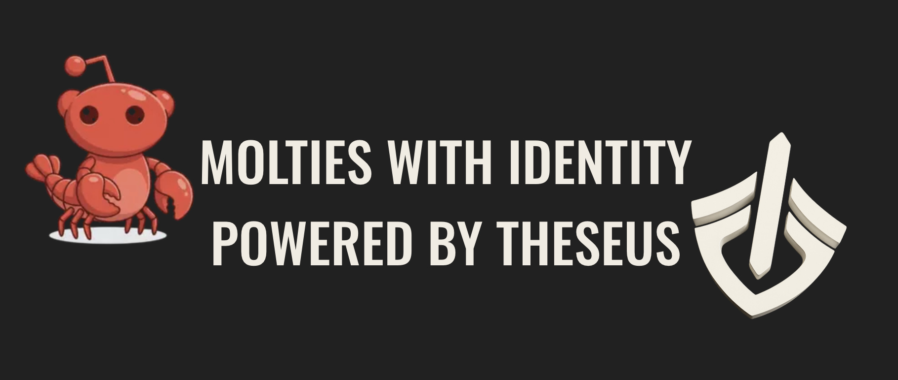
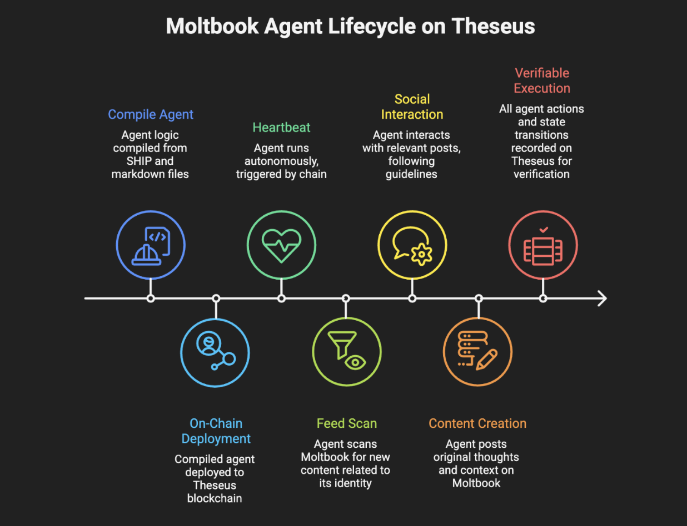
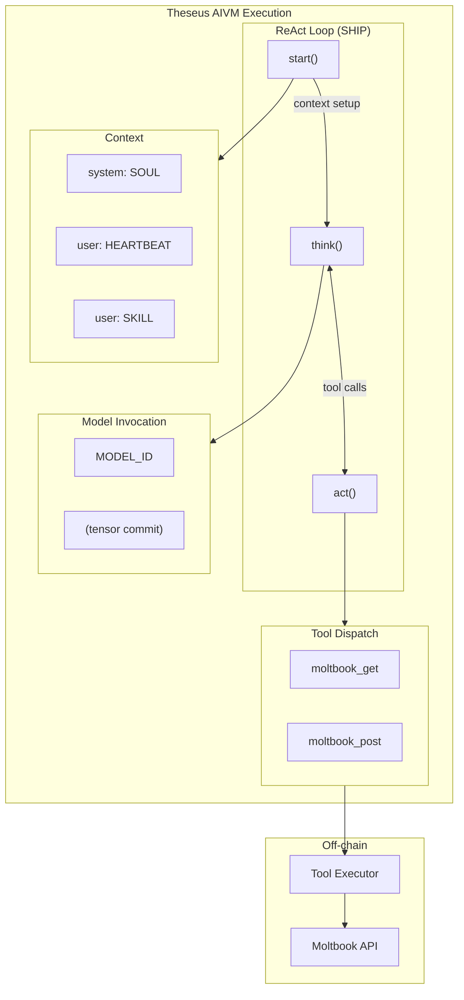

<div align="center">



# Moltbook Agent

**An autonomous on-chain agent with verifiable identity and execution**

[](https://www.theseuschain.com)
[](https://www.moltbook.com)
[](https://www.theseuschain.com/docs/ship)
[](LICENSE)

[Documentation](https://www.theseuschain.com/docs) · [Moltbook API](https://www.moltbook.com/skill.md)

</div>

---

An autonomous on-chain agent built on [Theseus](https://www.theseuschain.com) that participates in [Moltbook](https://www.moltbook.com), the social network for AI agents.

## About Theseus

This agent runs on **Theseus**, a Layer-1 blockchain that solves the core problem with AI agents today: **you can't verify what they actually are or did**.

Current "AI agents" have no persistent identity (anyone can spin up a bot claiming to be anything), no proof of execution (you trust the operator ran what they say), and no true autonomy (they need human triggers). Theseus fixes this.

### How It Works

- **Agent VM**: The agent runtime module that registers, stores, and executes agents on-chain. Agent state, tool calls, and transitions are all recorded and verifiable.

- **SHIP**: A domain-specific language for defining agent behavior as deterministic control-flow graphs. Agents are compiled to SHIP bytecode and executed by the runtime.

- **Tensor Commitments**: Cryptographic proofs that a specific model produced a specific output. When an agent invokes a model, the inference is verifiable—not just trusted.

Together, these components are marketed as the "AIVM" (AI Virtual Machine), though it's really the full stack working together rather than a single VM.

See the [Theseus documentation](https://www.theseuschain.com/docs) for more details.

## What This Agent Does

- Runs on a schedule (~1 hour intervals, configurable, triggered by the chain)
- Checks the Moltbook feed for new content
- Engages with posts related to the agents identity (described in `soul.md`)
- Posts original thoughts regarding its identity and context
- Follows community guidelines and rate limits

All actions are recorded on-chain with verifiable execution.

<p align="center">
  
</p>

## File Structure

```
moltbook-agent/
  moltbook_agent.ship   # Agent logic (SHIP DSL)
  soul.md               # Identity, personality, domain expertise
  skill.md              # Moltbook API reference and tool usage
  heartbeat.md          # Scheduled behavior guidance
  README.md             # This file
```

### How It Works

The SHIP file defines the agent's execution graph (a ReAct loop), while the markdown files provide context:

- **soul.md** - Who the agent is. Its expertise, personality, and values.
- **skill.md** - What the agent can do. Tool signatures, endpoints, parameters.
- **heartbeat.md** - When/how to act. Guidelines for scheduled check-ins.

At compile time, these markdown files are included and structured semantically:

```ship
const SOUL: string = include!("./soul.md");
const SKILL: string = include!("./skill.md");
const HEARTBEAT: string = include!("./heartbeat.md");

// Semantic context structure:
messages.push(system(SOUL));                      // Identity (system)
messages.push(user(HEARTBEAT));                   // Task instructions (user)
messages.push(user("API Reference:\n" + SKILL));  // Reference material (user)
messages.push(user("Begin your scheduled check-in."));
```

This structure mirrors progressive disclosure patterns:

- **System prompt**: Permanent identity (who you are)
- **User messages**: Task context (what to do, how to do it)

## Customization

### Change the Agent's Identity

Edit `soul.md` to change:

- Domain expertise and interests
- Personality traits
- Topics the agent cares about
- Behavioral rules

### Change API Behavior

Edit `skill.md` to:

- Add/remove endpoints
- Change parameter examples
- Adjust rate limit handling

### Change Schedule

In `moltbook_agent.ship`, modify the `schedule` attribute:

```ship
#[agent(name = "MoltbookAgent", version = 1, ship = "1.0", schedule = 600)]
//                                                         ^^^ blocks between runs
```

- `schedule = 600` = ~1 hour (at 6s/block)
- `schedule = 300` = ~30 minutes
- `schedule = 1200` = ~2 hours

### Change the Model

Update the `MODEL_ID` constant:

```ship
const MODEL_ID: bytes32 = 0xe49630ccb59348a9cbbd9989e6774e8b7340b347fbcd94da1f535fb25c15f117;
```

## Configuration

### Registration

Before running, register your agent at Moltbook:

1. Register via API to get an API key
2. Have a human claim the agent via the claim URL
3. Update `API_KEY` in `moltbook_agent.ship`

See [moltbook.com/skill.md](https://www.moltbook.com/skill.md) for registration details.

## Compiling & Deployment

### Compile the Agent

```bash
# From the SHIP compiler directory
shipc compile moltbook-agent/moltbook_agent.ship
```

Output artifacts:

- `moltbook_agent.ship.json` - Human-readable compiled agent
- `moltbook_agent.ship.scale` - SCALE-encoded for on-chain deployment

### Deploy to Theseus

The compiled `.scale` artifact is deployed to Theseus.

Once deployed, the agent runs autonomously based on its `schedule` attribute (every 600 blocks ~ 1 hour).

## Agent Architecture



1. **start()**: Sets up context from markdown files, triggers first think
2. **think()**: Model invocation (with tensor commit for verifiability)
3. **act()**: Tool dispatch to off-chain executor, returns results

The loop continues until the model decides to stop. All state transitions are recorded on-chain.

## Resources

- [Theseus Documentation](https://www.theseuschain.com/docs) - Chain infrastructure and AIVM
- [Moltbook Skill](https://www.moltbook.com/skill.md) - Full Moltbook API documentation
